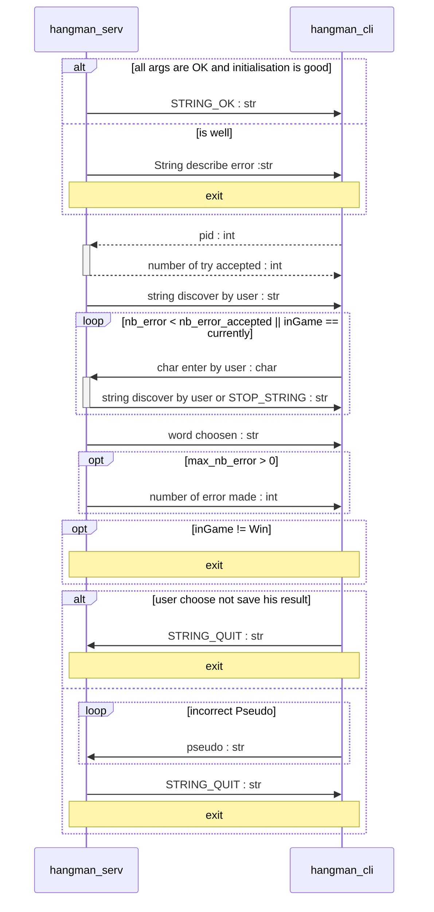

# Game server project

## Université de Franche-Comté

### Alphée GROSDIDIER & Lucien MARTIAL

## Final Production Report

To launch the server, simply run the command ***./server*** in the **build/** subdirectory. To launch a game, the server must be launched. All the games are in the subfolder games/ to launch a game you must enter the command ***./client <games/gamename> args...*** in the directory **builds/**.

For the server to run permanently, it must be in daemon mode. By calling the ***./launch_daemon*** process by issuing the command ***./launch_daemon ./server***.

In this game server project, we have created a server, a client and a hangman game, in two parts (hangman server and hangman client). During the development of this project, we tried to factorize the code as much as possible by coding many functions and a library.
We created a library (**libmessage.so**) and a header file for each program. We have also coded a header file named **utils.h** which allows us to have various functions to facilitate the manipulation of structures in our programs.

In order to facilitate the debugging and maintenance of the program, we have made extensive use of macro definitions. We have also checked all the results of system call returns to avoid potential bugs as much as possible. We have created as mentioned above a process which transforms the server into a demon and makes it run in the background.

To assemble our project we made a complete makefile which takes into account all the programs.

### The Hangman game

--Signals in hangman game--

SIGUSR1 signal in hangman_cli is useful for timeout. The SIGUSR2 signal in hangman_cli is useful for a server problem.
The sigalarm hangman_serv sends SIGUSR1 to the client and then stops.
If SIGINT, SIGTERM or SIGQUIT signals are detected, in hangman_serv it sends SIGUSR2 to the client.

--Hangman game useful macros--

The randomly chosen words are taken from SERV_WORD_FILE_PATH.
If the user decides to save his nickname after a game, this saves the results in the macro file RESULT_FILE.

### Utils

Here we define 5 function used in the project:

* unsigned int randInt(unsigned int max);
It generate a random number on 32 bytes to avoid problem with rand() generator. On some computer tis function can renuturn only number less then 32000. Our dict contai about 32500 so we decided to create this function.

* int have_space(char * str);
Common function for hangman_cli and hangman_serv for verifying if pseudo entered is valid and contain no space. We don't want to have duplicated function so we put it here.

* void flush(FILE * fp);
Mainly use to flush stdin when we get a char with fget() to avoid undesirable chars.

* size_t count_file_lines(FILE * fp);
A general function to count number of lines in a file. It takes in argument the file pointer.

* int digit_in_number(int nb);
Count the number of digits in a number. We use it to create dinamically the name of fifo used by client and server.

### Project testing

In this project we first tested the **libmessage.so** library. We launched the **test_cli** and **test_serv** test programs, we also tested all the interrupt signals on each program, the hangman timeout. Tried to launch several programs at the same time on the server. All these tests were used with valgrind. And all these tests have been successfully passed.

### Not done

On the other hand, when the child processes of the server ended, we didn't delete the named pipes which were associated with them to communicate. They are deleted only when the server stops. This poses a problem if the server is in daemon mode for too long and the folder where these files are stored is full. We don't check if the associated client is terminated when we receive a SIGCHLD signal from the server.

## Possible improvements

In order to remove FIFOS when clients terminate. We wanted to code a linked list which associates for each node a child server and the PID of its associated client.
We have finished the implementation that we left as a comment in the server and in **utils.c**, we were almost there but we are stuck on a sudden segfault. Finishing this implementation would have allowed us to finish the two unfinished things mentioned at the end of the previous part (the verification of the end of the client and the deletion of the communication FIFOS).

## Review of working in pairs

In order to work harmoniously in pairs, we shared the tasks between the server, client, daemon and the games and the makefile. We sometimes coded similar parts and merged our work. We are very complementary and the work is going perfectly.
